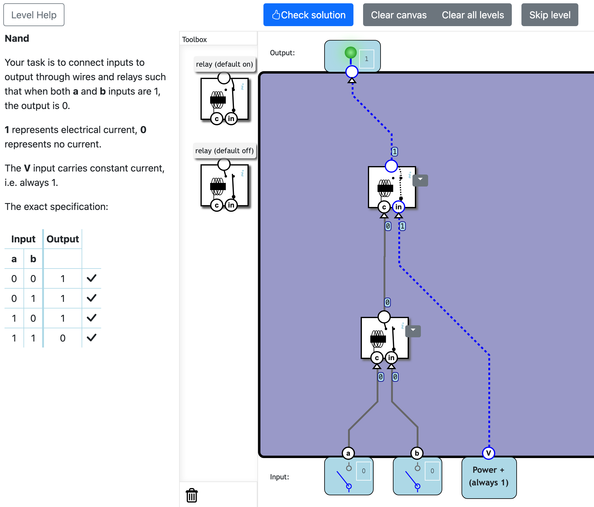
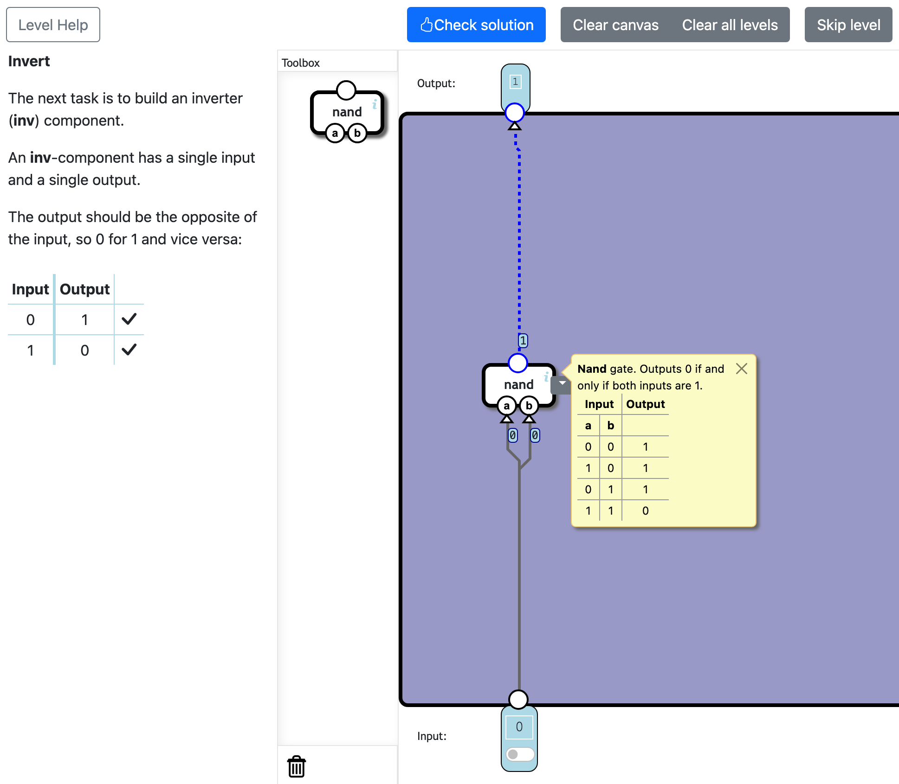
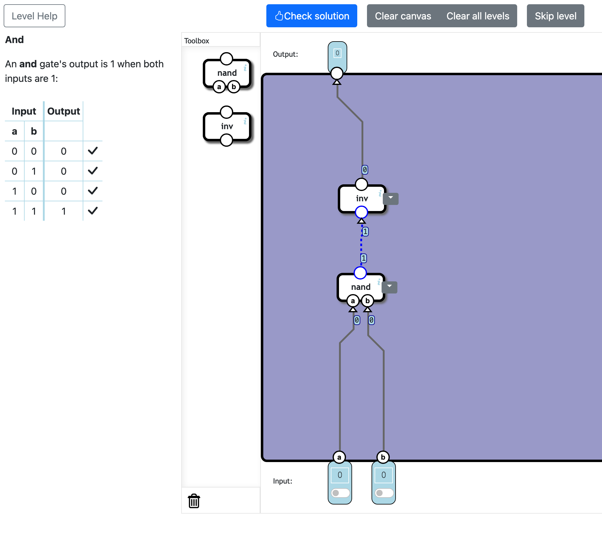
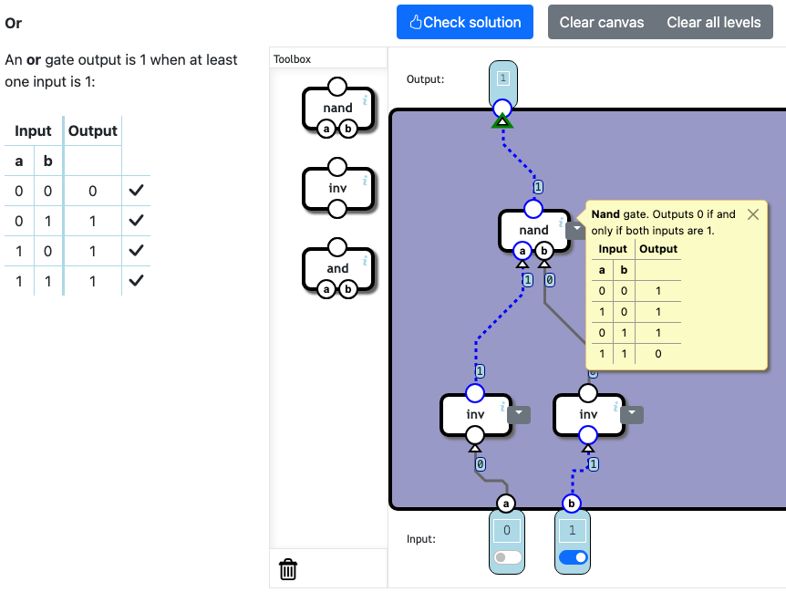
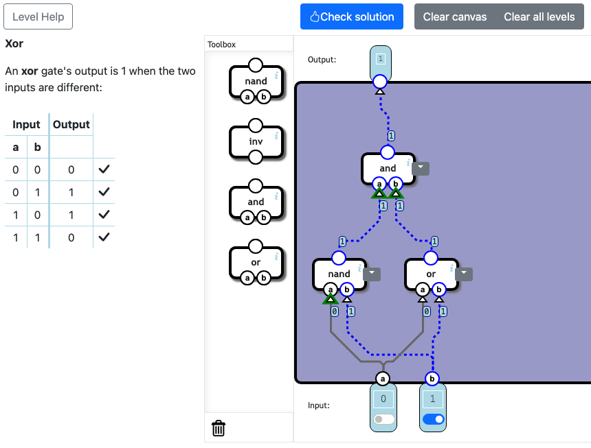

# 61992-ARQ-COMP-SO-1-CDA-1A
Repo for the course

# NANDGAME 
## Logic Gates
### NAND

En un principio, no entendía muy bien como funcionaban los Releys, las conexiones entre ellos y como las manejaba la plataforma. Trataba de conectar varios intentando crear operadores lógicos, asumiendo que los Relays sean como switch. Pero los Releys funcionan un poco diferente. 

Al conectar las 2 entradas de un Relay, yo esperaba que la salida sea uno. Y ese no fue el resultado. Por que no son exactamente Switch, o en otras palabras funcionan un poco diferente. Tras varias pruebas llegué a la conclusión de que ya tienen un estado por defecto. Puede ser 1 o 0. 

Teniendo eso en cuenta, al conectar las 2 entradas la salida es lo contrario de su valor defecto. 

Entonces, el relay en estado **OFF** se comporta como un AND, porque al conectar las 2 entradas, y combinarlas obtenemos:

| A | B | Output |
|---|---|--------|
| 0 | 0 | 0 |
| 1 | 0 | 0 |
| 0 | 1 | 0 |
| 1 | 1 | 1 |

El Relay en **ON** es un poco mas complejo. Y vamos a desglosarlo. 

| A | B | Output |
|---|---|--------|
| 0 | 0 | 0 |
| 1 | 0 | 0 |
| 0 | 1 | 1 |
| 1 | 1 | 0 |

Por que tenemos paso de corriente solo con 0 y 1 ? 
- El primer paso es negar A (NOT A)

| NOT A |
|---|
| 1 |
| 0 |
| 1 |
| 0 |

- Segundo paso es hacer un **AND** entre **NOT A** y **B** y obtenemos el mismo resultado que **Relay ON**

| NOT A | B | Output |
|-------|---|--------|
| 1 | 0 | 0 |
| 0 | 0 | 0 |
| 1 | 1 | 1 |
| 0 | 1 | 0 |

Teniendo claro todo eso, se proce a energizar las entradas y contectar las salidas.

### Invert
Como podemos ver en la imagen, solo vamos a representar 2 estados. Prestamos atención la primera y última fila del NAND. Que son los pares (0,0) y (1,1). Sus resultados son invertidos. Teniendo eso en cuenta conectamos las 2 entradas del NAND a la misma fuente de energía. 

### And
El operador AND es mas sencillo. Si el NAND (que hicimos al comienzo), era la negación del AND, para volver a hacer AND, tenemos que volver a negaro con un INVERT

### Or
Prestando atención a la tabla de del OR notamos que es contraria al AND, por ello negamos las ambas entradas con INVERT. 

### Xor
Nos fijamos en sus salidas (0,1,1,0). Para lograr dicha salida el OR obtenemos las 3 primeras salidas (0,1,1). En el último par nos falla ya que 1 y 1 = 1 pero necesitamos un cero. 

Con eso descubrimos que el par del conflicto es (1,1). Fijándonos en los demás operadores con NAND podemos obtener 1 y 1 = 0. Asi que energizamos sus dos entradas a A y B respectivamente. 

Con OR obteníamos 3 primeros pares. Asi que tambien conectamos sus entradas a A y B respectivamente. 

Finalmente unimos los resultados de NAND y OR usando AND. 

