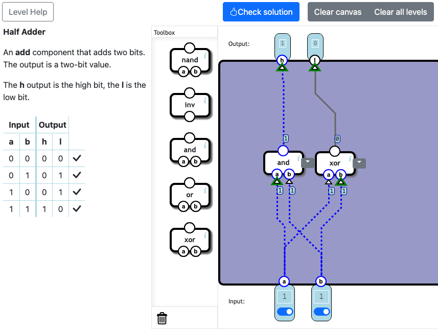
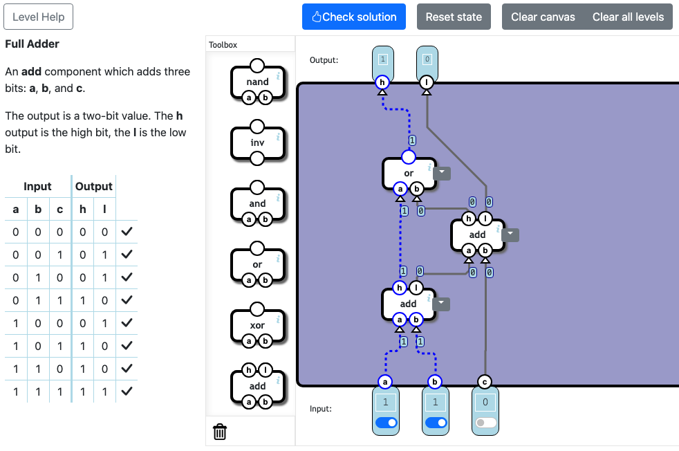

## Arithmetics
### Half Adder
Es mas sencillo de lo que parece. Si nos fijamos en las salidas que debe tener **h**, es igual un AND. Y si nos fijamos en las salidas que debe tener **l** es igual a un XOR. Así que agregamos los operadores y conectamos sus entradas a la corriente respectivamente. 



### Full Adder
Para entender esta suma de 3 bits, repacemos un poco los numeros binarios. 

Nosotros, usamos la base 10 para representar numeros y hacer operaciones. 
Como por ejemplo si quiero sumar 10 + 10 = 20

Hacer eso en binario seria muy dificl de hacerlo porque tendriamos largas filas de numeros entre 0 y 1. La base 10 es porque tenemos numeros en 1,9. Si queremos representar el diez es una combinacion entre uno y cero. 

Por eso en la base 2 se usa solo numeros entre cero y uno. 

- El numero 1 en decimal es 1 en binario
- El numero 2 en decimal es 10 en binario
- El numero 3 en decimales 11 en binario

Esto es importante porque un Full Adder el número máximo que puede tener como resultado es 3 (11<sub>2</sub>).

| A | B | C | Output |
|---|---|---|--------|
| 1 | 1 | 1 | 11

- A: Es el sumando numero 1
- B: Es el sumando numero 2
- C: Es el carry, o mas conocido, lo que llevamos. 

Realicemos un ejemplo pequeño de una suma en binario. 
```text
  1
+ 1
 ---
  10 ===> (primero sumamos los numeros como si fuera en base diez, que es 2. Y 2 en en binario es 10)
```

Analicemos el resultado 10<sub>2</sub>

- 0: Es el valor real de la suma. En un Relay es **l**
- 1: Es lo que llevamos, o carry. En un Relay es **h**

El ejemplo que acabamos de hacer, es un Half Adder, porque solo sumamos 2 bits y el numero maximo que se puede obtener con 2 bits es 2 en decimal.

Ahora a la suma anterior sumemos un bit mas para que se convierta en un Full Adder. 

```text
 10 => Resultado anterior en binario
+ 1
 ---
 11 ===> (10 es 2 en decimal. 2 + 1 = 3. Y 3 en binario es 11)
```

Ahora, esta mas claro el resultado de la tabla anterior. En un Full Adder su resultamos maximo es 3 y solo puede tener un carry. Si queremos sumar numeros mas grandes que 3, tenemos que combinar varios Full Adder. De igual manera por cada Full Adder que aumentemos tendremos un bit mas para Carry. 


