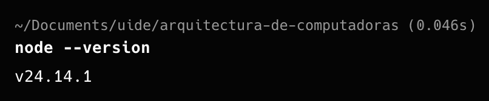
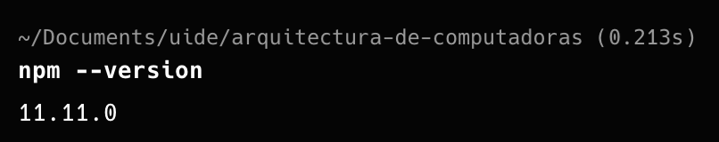
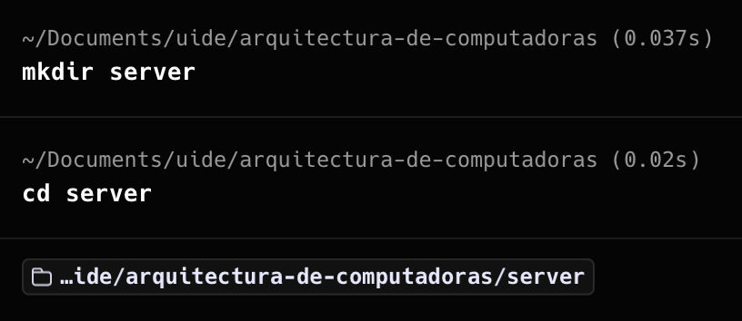
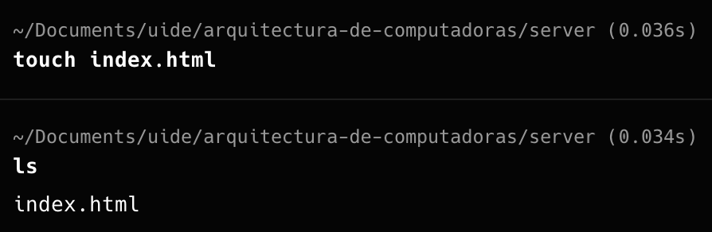
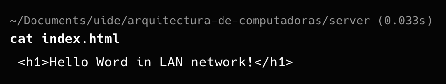
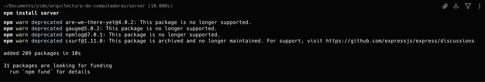
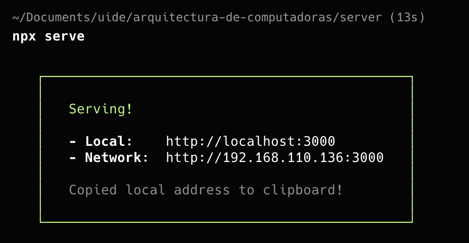
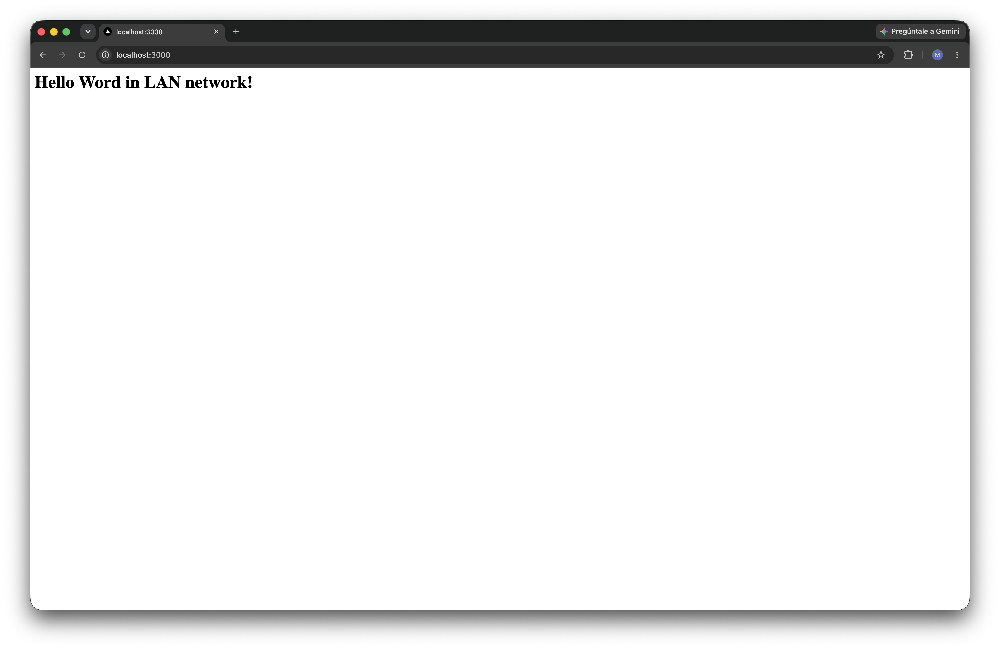
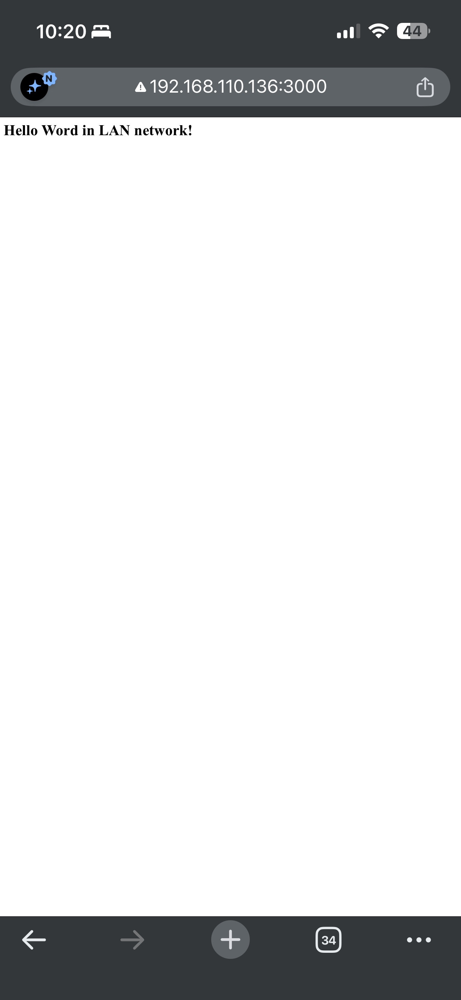

# Iniciar un servidor en una red LAN

## Instalacion de dependencias
En este ejemplo usaremos nodejs para levantar un servidor. 
Asi que antes de comenzar nos aseguraremos de tener instalado nodejs, podemos seguir las instrucciones de supagina oficial. https://nodejs.org/es

- Ejecutamos el siguiente comando en el terminal para asegurarnos que tenemos nodejs instalado.
```shell
$ node --version
```

- Ejecutamos el siguiente comando en el terminal para asegurarnos que tenemos npm instalado.
```shell
$ npm --version
```


## Creacion de un proyecto

- Creamos una carpeta con el comando `mkdir <project_name>` y nos dirigimos alli con `cd <project_name>`


- Creamos un archivo index.html con `touch index.html`


- En html, todo lo que se pueda renderizar es un nodo. Desde etiquetas (h1, div, span, etc), text, numeros e incluso espacios. En este ejemplo usaremos h1, simplemente para que el texto se vea grande. Pero puede ser un texto simple. Y para ello usaremos nuestro editor favorito. 


## Levantar el servidor

- En la direccion o ruta de nuestro proyecto ejecutaremos el siguiente comando `npm install server`. Esto instalara las dependecias necesarias en una nueva carpeta llamada `node_modules` para leventar el servidor.


- Iniciar el servidor con `npx serve`. Por defecto usa el puerto 300. Nos muestra una direccion **Local** que podemos abrir en el navegador de nuestro host. Pero para los demas miembros de nuestra LAN deben usar la direccion **Network**


- Mostrando nuestra pagina en el host


- Mostrando nuestra pagina desde un dispositivo diferente. Usando la direccion **Network**


> [!WARNING]  
> Algunos navegadores pueden bloquear el acceso a direcciones no seguras (http)

> [!TIP]
> Los dispositivos externos podran acceder al servidor siempre y cuando todos esten conectados a la misma red.