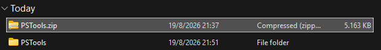
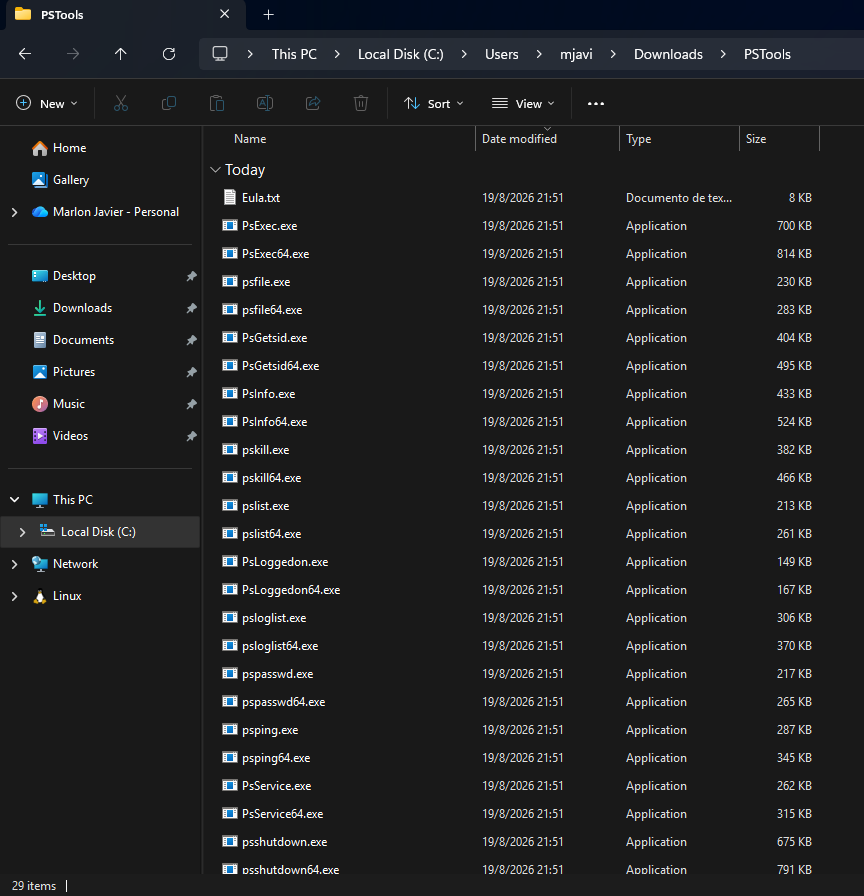
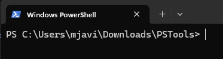
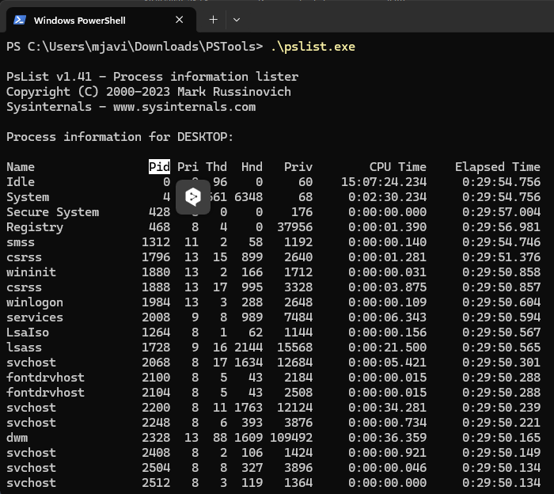
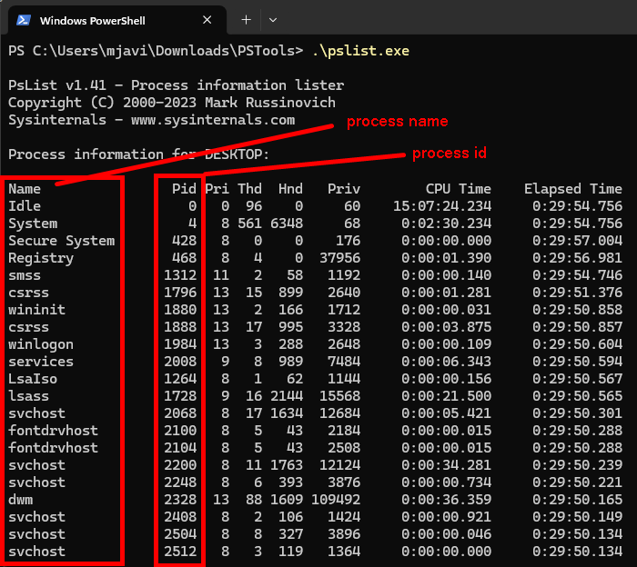
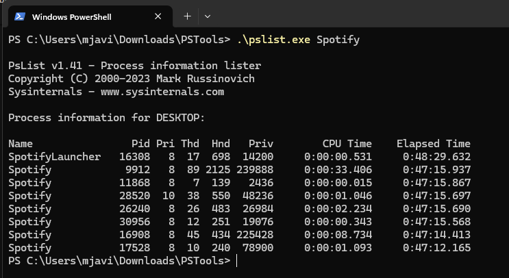
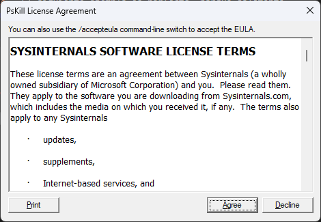
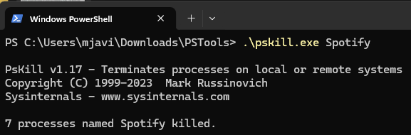
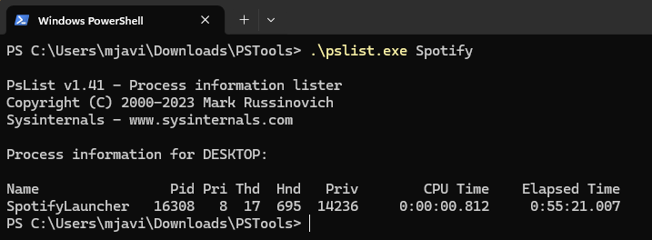

# PsKill

PsKill es una utilidad de linea de comandos de Sysinternals (Microsoft) que sirve para finalizar procesos o programas en ejecucion tanto en el equipo local como en equipos remotos. Es similar al comando kill de sistemas Unix/Linux.

Se usa para: 
- Cerrar procesos bloqueados o que no responden.
- Terminar aplicaciones especificas mediante su PID (Process ID).
- Finalizar procesos en un equipo remoto sin instalar software adicional en el equipo de destino.

Ejemplo: `pskill 1234`

## Pasos 

1. Nos vamos a dirigir a la siguiente página para descargar la herramienta. https://learn.microsoft.com/en-us/sysinternals/downloads/pskill

2. Eso nos va a descargar un archivo .zip con otras herramientas adicionales. Asi que una vez descargado lo vamos a descomprimir.

3. Posteriormente, antes de detener un proceso primero debemos listarlos. Para ello podemos usar el Administrador de tareas, powershell o la misma herramienta que acabamos de descargar. En mi caso, usare la herramienta que acamos de descargar. Su nombre es `pslist.exe`

4. Todas son utilidades de la línea de comandos. Asi que que para ejecutarlas debemos abrir nuestro terminal en la ubicación que acabmos de descomprimir. 

5. Ejecutamos `pslist.exe`

6. Uso `pskill [- ] [-t] [\\computer [-u username] [-p password]] <process name | process id>`

|Parameter|Description|
|---------|-----------|
|-	|Muestra las opciones disponibles.|
|-t	|Elimina el proceso y sus procesos descendientes.|
|\\\computer	|Especifica el ordenador en el que se está ejecutando el proceso que deseas finalizar. Debe ser posible acceder al ordenador remoto a través del entorno de red de NT.|
|-u username	|Si deseas finalizar un proceso en un sistema remoto y la cuenta con la que estás ejecutando el comando no tiene privilegios de administrador en dicho sistema, deberás iniciar sesión como administrador utilizando esta opción de línea de comandos. Si no incluyes la contraseña con la opción -p, PsKill te pedirá que la introduzcas sin mostrar lo que tecleas en la pantalla.|
|-p password	|Esta opción te permite especificar la contraseña de inicio de sesión en la línea de comandos para que puedas utilizar PsList desde archivos por lotes. Si especificas un nombre de cuenta y omites la opción -p, PsList te pedirá la contraseña de forma interactiva.|
|process id	|Especifica el ID del proceso que deseas finalizar.|
|process name|	Especifica el nombre del proceso o de los procesos que deseas finalizar.|

7. Eliminando un proceso. Primero vamos a identficiar un proceso. En este caso vamos a detener el proceso de Sotify. Y para una mejor visualizacion usaremos un filtro a `pslist.exe`. El siguiente ejemplo es perfecto, porque solamente vamos a detner el proceso `Spotify` y tras detenerlo deberia seguir activo `SpotifyLauncher` porque son procesos diferentes. 

8. Ejecutar el comando `pskill.exe Spotify`. La primera vez nos mostrara el siguiente dialogo de licencia. Aceptamos y listo.

9. Tras haberlo ejecutado nos muestra un mensaje que 7 proceso han sido detenidos. 

10. Comprobacion. Ejecutamos nuevamente `pslist.exe Spotify`. Podemos notar que todos los procesos llamados `Spotify` se eliminaron. En este caso se eliminaron 7 porque al eliminarlos lo hicimos mediante el nombre, y 7 se llamaban igual. Para tener mas control de los procesos podemos usar su ID o Pid

